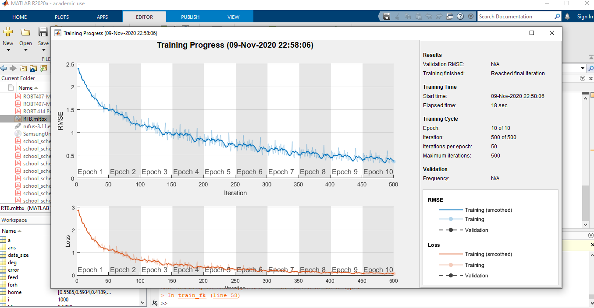
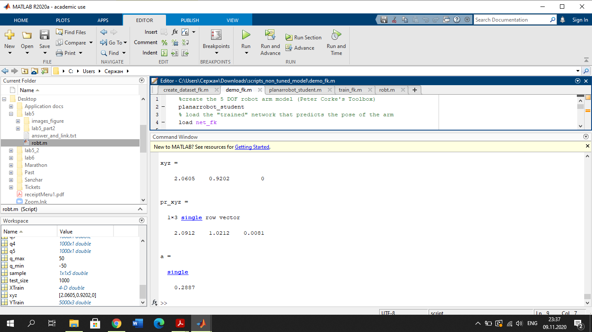
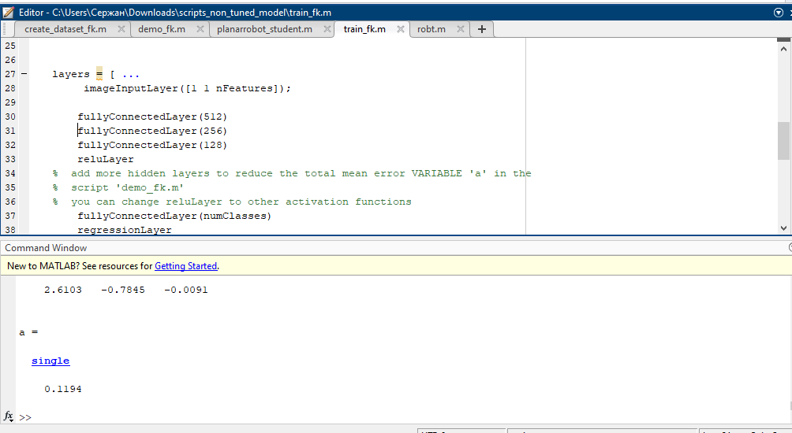
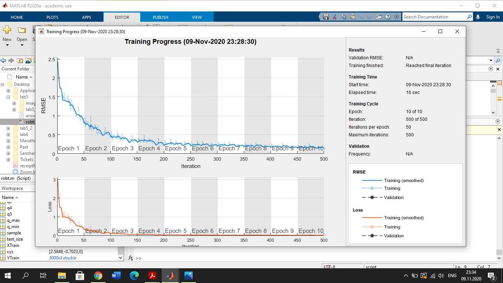
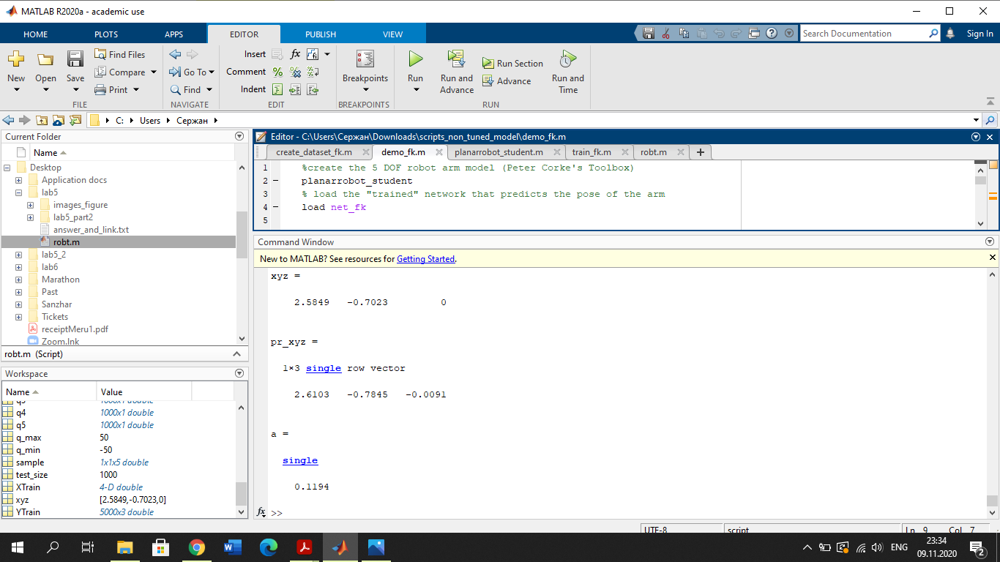
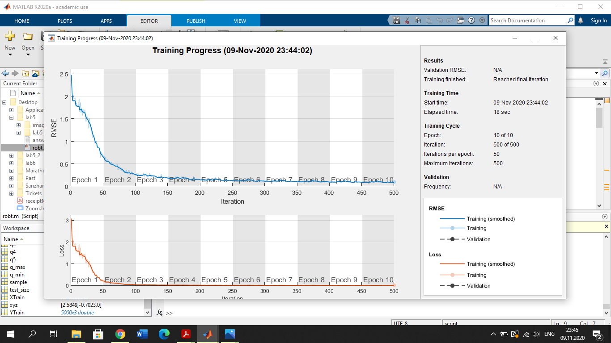

# This is for lab6 ROBT403
### This was initially: err - 28,8 %

### Then additional Layers were added:

### and the result was like following:
### much better than before err - 11,94 %

### then the tanhLayer was added to improve the result:

### it is improved and the error was 6,66 %

