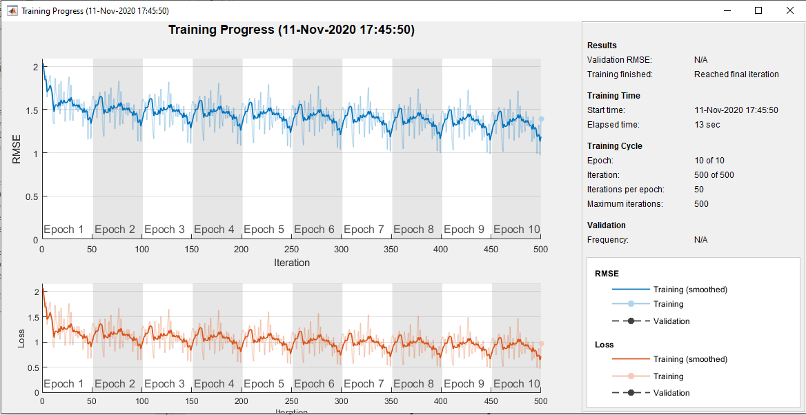
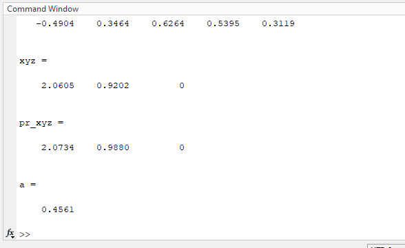
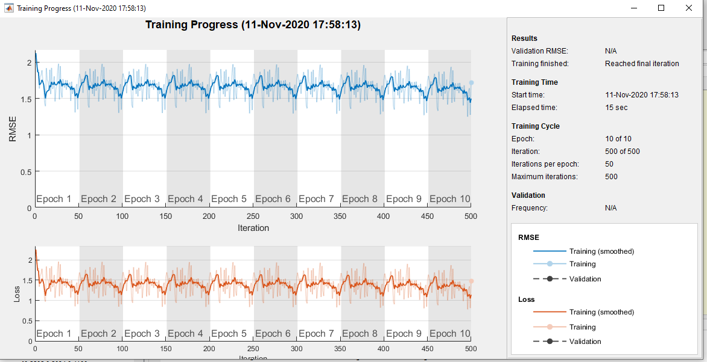
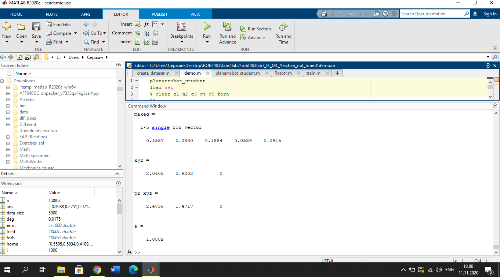
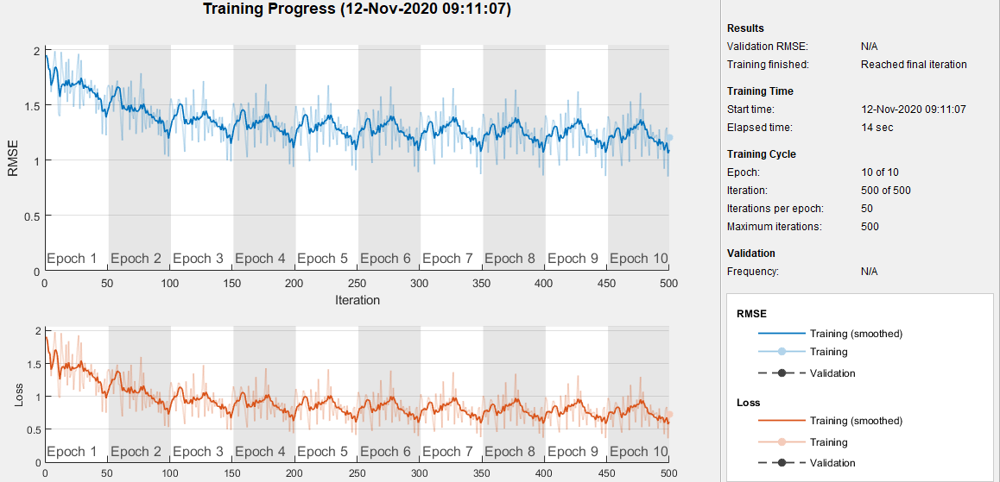
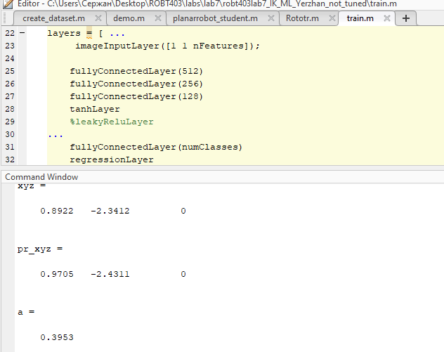
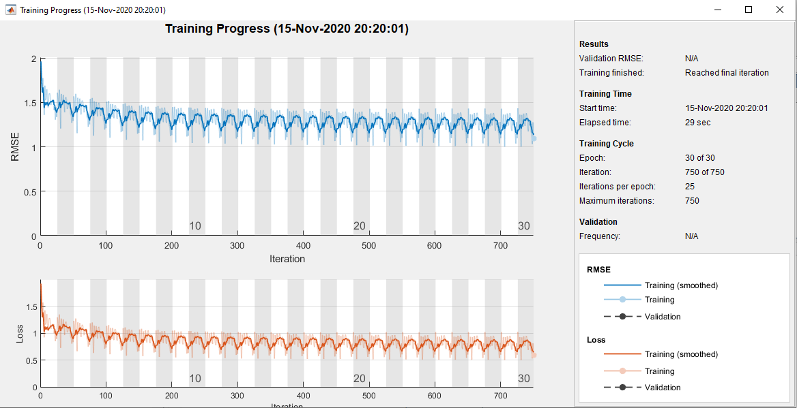
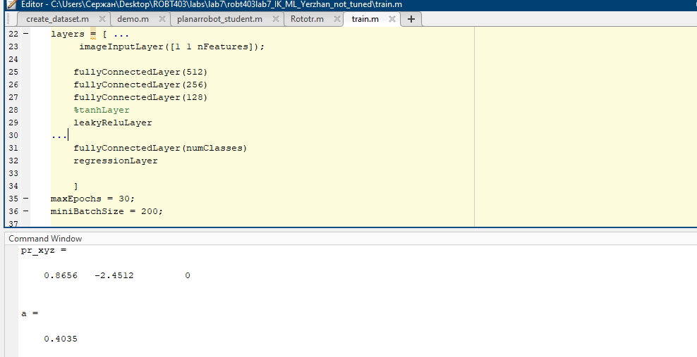
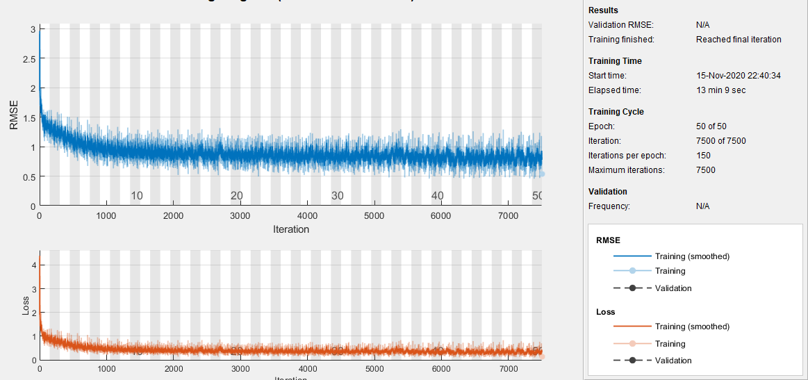
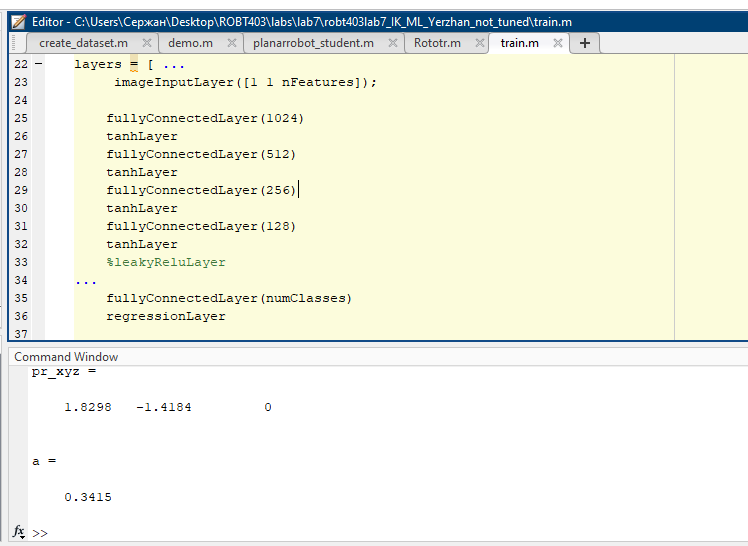

# This is for lab7 ROBT403
### The error was initially:45,61%

### Then tanh Layer was added:

### and the result was like following:
### much worser than before err - 108.02%

### then several layers were added (512-256-128)
### the result showed better

### after that maxEpochs was changed to 30 and miniBatchSize to 200 with architecture 512-256-128 with leakyReluLayer

### tanhLayer several times:

