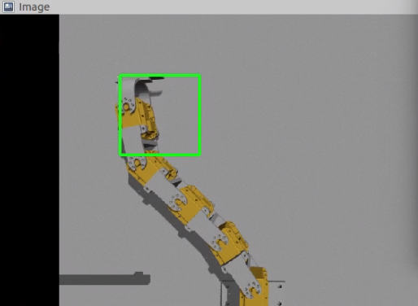
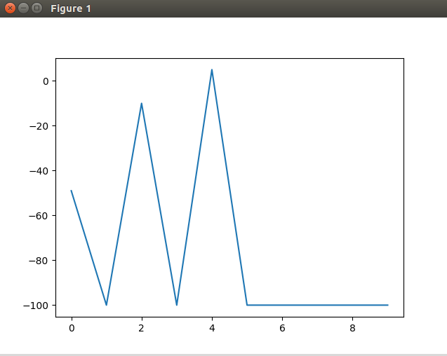
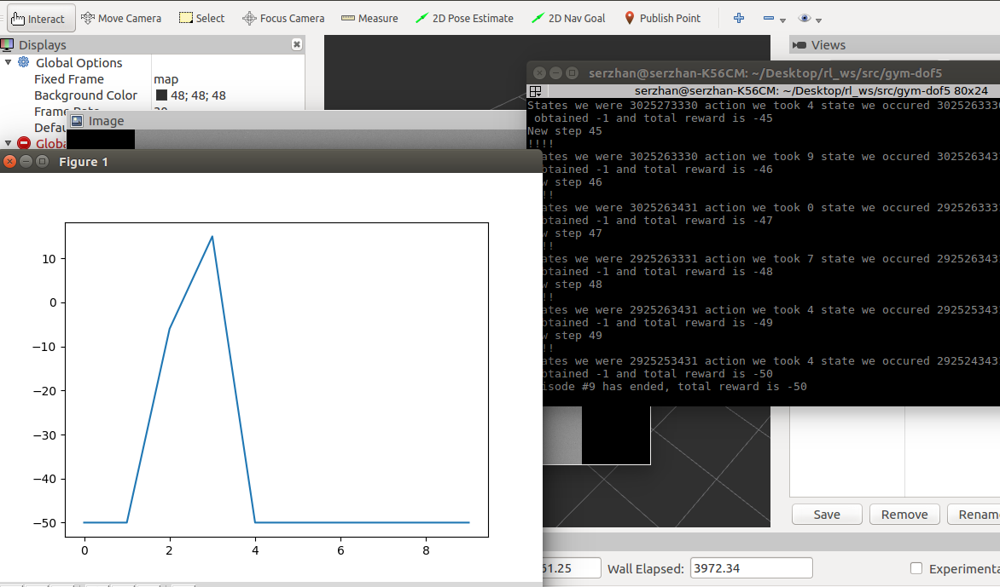

# Laboratory 8.

### The goal
The goal is to locate robot's end-effector to the desired location. So, we use REinforcement Learning approach to solve IK problem

### Initial parameters
Inital values: alpha is 0.9, epsilon 0.1 and gamma 0.1.
Initially the values were not changed and the training was going on. However, my laptop could not work for several hours to finish the training, so I had to stop it.
Laptop overheated.

### Later changes
The changes that I made were:
alpha was decreased to 0.1, while epsilon and gamma were increased to 0.9
Then I have decreased the number of episodes to 10, because again if I will increase the number of episodes, my laptop will burn out (which is not the best case in front of final's week)

[Link to the video on youtube](https://youtu.be/3om-xpDOWuw)

So, the result was like this:

### Further changes:
The values of alpha was increased to 0.3, while for epsilon and gamma were decreased to 0.7 for both of them
Then I have decrease the number of steps from 100 to 50

[The video on youtube](https://youtu.be/3MCgA19bldI)

The result was like this:

### Conclusion:

[The video on youtube](https://youtu.be/sbmb4P05VL8)

Generally, the robot was going to the right as it can be seen from the video.
I would put as maximum episodes as I could and put the number of steps larger, but the power of the laptop could not allow to do that. Unfortunately I couldn't experiment much more with the parameters. But it is much better to put maximum epsilon and minimum alpha.
